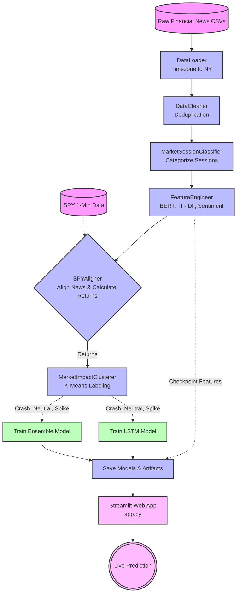

# AI Market Impact Predictor 📈

An end-to-end machine learning pipeline and web application designed to predict the short-term stock market impact (Crash, Spike, or Neutral) of financial news headlines. The project utilizes natural language processing (NLP), embeddings, and historical SPY index data to align news events with market movements.

## 🚀 Key Features

- **Automated Data Pipeline**: Loads, cleans, and deduplicates financial news data.
- **Advanced Feature Engineering**: Uses `SentenceTransformers` (BERT) for dense embeddings, TF-IDF for sparse features, and heuristic scoring for sentiment and urgency.
- **Market Alignment**: Precisely aligns news release times with 1-minute SPY ETF data, factoring in market sessions (Pre-market, Regular, After-hours).
- **Unsupervised Clustering**: Uses K-Means clustering to classify historical price reactions into three categories: Crash, Neutral, and Spike.
- **Hybrid Modeling**: Trains an Ensemble model and an LSTM network to predict market impact from news features.
- **Interactive Web App**: A Streamlit interface (`app.py`) for live, real-time predictions of arbitrary news headlines.
- **Checkpointing**: Auto-saves intermediate features to disk, drastically speeding up subsequent runs.

## 📂 Project Structure

```text
├── app.py                  # Streamlit web application for real-time predictions
├── clusterer.py            # K-Means clustering to generate impact labels
├── config.py               # Global configurations, paths, and hyperparameters
├── data_cleaner.py         # Removes duplicate and highly similar news entries
├── data_loader.py          # Loads CSVs and handles timezone conversions
├── feature_engineer.py     # Extracts NLP, sentiment, and time-based features
├── main.py                 # The core execution pipeline
├── market_session.py       # Classifies news into market trading sessions
├── models.py               # Defines and trains Ensemble and LSTM models
├── save_artifacts.py       # Utility to save standalone artifacts for the web app
├── spy_aligner.py          # Aligns news timestamps with historical SPY returns
├── visualizer.py           # Evaluation plots and confusion matrices
└── requirements.txt        # Python dependencies
```

## 🏗️ System Architecture & Pipeline Flow

The following flowchart details the end-to-end process from raw data ingestion to the final web application.



## 🛠️ Setup & Installation

1. **Clone the repository and navigate to the directory**:
   Ensure you are in the `hadi` project directory.

2. **Install Dependencies**:
   ```bash
   pip install -r requirements.txt
   ```

3. **Run the Main Pipeline**:
   Execute the core training pipeline. This will process the data, generate embeddings (which can take a few minutes), train the models, and output evaluation metrics.
   ```bash
   python main.py
   ```
   *Note: The pipeline automatically checkpoints at Step 5. If it crashes, restarting will resume from the checkpoint.*

4. **Prepare Artifacts for the App**:
   Ensure all vectorizers and scalers are saved.
   ```bash
   python save_artifacts.py
   ```

5. **Launch the Web Application**:
   Start the interactive Streamlit app to test predictions.
   ```bash
   streamlit run app.py
   ```

## 🧠 How the Prediction Works (Hybrid Engine)

The web application (`app.py`) utilizes a **Hybrid ML-Heuristic Engine**:
1. **Machine Learning Base**: Uses the trained Ensemble model and dense BERT embeddings to evaluate context.
2. **Heuristic Amplifier**: Because 5-minute SPY returns are notoriously noisy, the base model can be overly conservative. A built-in sentiment amplifier detects obvious trigger words (e.g., "crash", "rate hike", "surge") and adjusts the probability distribution to align with expected human intuition for major macroeconomic events.
